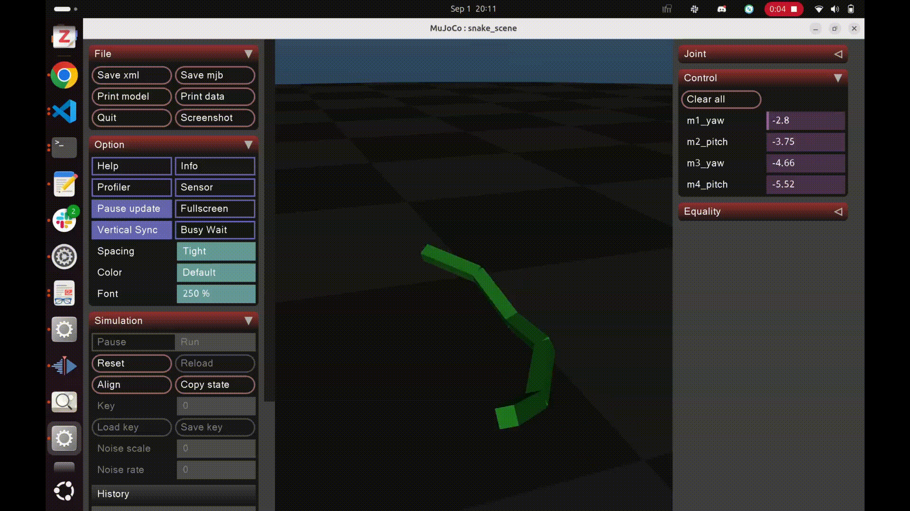

# HRC Software Onboarding Fall 2025


This document walks you through the onboarding task for HRC Software such that by the end of this onboarding project, you will have created a (semi) walking quadruped simulated on your computer.\
\
For this onboarding project, you will make a mujoco xml specification of a robot dog, simulate it in a python simulation loop, and write a PD controller and walking program for it in simulation.\
\
The goal of this onboarding is for you to get some familiarity with the world of programming legged robots such as thinking about robots and their control physically (kinematics) and the usage of simulation. During this project, you cannot solely rely on the readme and are encouraged to read a bit more about legged locomotion and robotics.

## Experience Assumptions
This project assumes basic familiarity with Python programming, programming with vectors (numpy), git and common software management practices. All the following steps about installation and setting up environments are done on linux terminal. Don’t worry if you are not familiar with these skills, they can be picked up quickly and are always useful.

## System Requirements
Linux based computer, emulator (mac OS), wsl

# Robotics Simulation
Simulation is very important in robotics and other complicated systems because legged robots are to expensive and fragile to do trial and error techniques on real hardware. Thus we would like to test our control software in simulation before deploying it on real hardware. \
\
In simulation, we model legged robots as rigid bodies connected by rotary joints with each joint representing (with caveats) a real life motor. The simulation is used to test control software which controls the robot by outputting joint torques (the lowest level abstraction to hardware) to the motors.
# Python Environment
Good python programming practice necessitates the use of virtual environments to have a python interpreter that has the packages you need. 

(If you are familiar with python environments, install environments however you like with numpy as mujoco)

In your projects folder, make a python venv with:

```
python3 -m venv [your env name here]
```

This will make a folder of your env name that contains the python interpreter of the virtual environment. You will know it is active in your terminal by the presence of the ([env name]) before your user name and directory. You can activate and deactivate the venv with:
```
source [your env name]/bin/activate // run the bash file to activate the venv
deactivate // deactivate the venv
```
With your venv activated, install mujoco and numpy with
```
pip install mujoco
pip install numpy
```
# Mujoco Snake Example

To help you get started, this github repo contains an example python script simulating a snake in mujoco. Clone this repository into your local machine with:
```
git clone https://github.com/humanoid-purdue/onboarding-fall25
```
And with your set up environment with mujoco you can run:
```
python visualize_snake.py
```
To see a gui with a snake flopping around on the floor.
## File Structure 
This repo contains two files, snake.xml and visualize_snake.py. snake.xml contains the specification of the snake robot in the simulation. The details of how the specification works can be found online. visualize_snake.py generates a model and data variable from the xml, and runs a single timestep through mj_step(model, data) before visualizing with viewer2. model represents the physical properties of the world and data represents the state of the world at a certain timestep. At each timestep, joint torques in the form of a numpy array is loaded into data.ctrl.\
\
The state of the simulation (including all the joint positions) is printed out to the screen as a 11 dimension vector in data.qpos. The first 3 elements represent the xyz position of the robot, the next 4 are a quaternion representing the orientation of the robot and the last 4 elements represents the joint position of each joint. The velocity information is stored in data.qvel.
